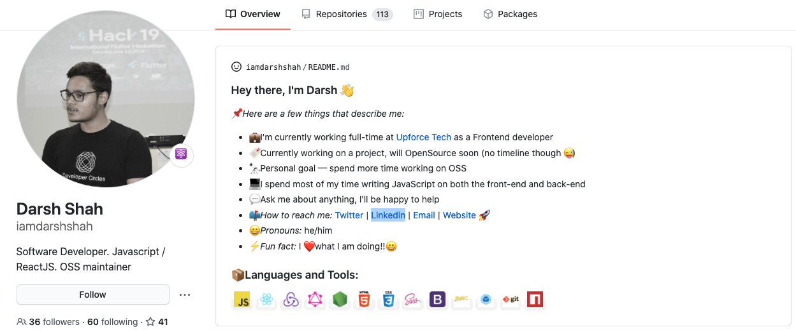
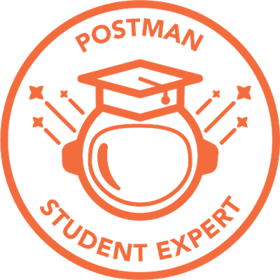

_Hello 👋, and welcome to the Intro to React Bootcamp!_

## 🤓 Who Are You

> 💡 **TLDR**: You know some JavaScript

This course is for anyone who wants to get up to speed with React. You can be complete new to React or you know some basics of React.

Some, but not much, JavaScript knowledge is recommended to get the best from this course.

## 🥂 What You Can Expect

This bootcamp's goal is to walk you through the basics of React and the ability to create an app using React. This will help you to have a great foundation to learn more advanced topics.

## 🤝 Contributing

Find a typo or error? This bootcamp is open-source; make a [Pull Request](https://github.com/iamdarshshah/reactjs-course)!

## 👨‍💻 Who Am I

My name is Darsh Shah, Frontend developer @Upforce Tech. Since, after completing my high-secondary schooling I was into Tech as we had C++ as a programming language during those days. I love learning new technologies and build something on top of it. I have been part of many Hackathons globally as a Participant, Mentor & Judge.

I am part of many developer communities out there like Facebook developer circles, Google developers group, Google cloud developers communtiy and many more. Recently, two days back I earned a badge of "Student Expert Program" from [Postman](https://www.postman.com/). So, now I'm part of Postman's student developer program and will be taking session on working with Postman.

Outside of code, I love travelling to different parts of world and my goal is to explore as many places as I can (work is in progress!!). Apart from that, I like playing chess in my free time and LOVE to Dance 🕺. Recently, I've gotten into Mentoring & Judging different Hackathons happening globally. That's pretty much it, I can't share my address 😅 but, I currently live in Ahmedabad, Gujarat, with my family.

> Reach Out To Me!: [Twitter](https://twitter.com/iamdarshshah), [linkedin](https://www.linkedin.com/in/iamdarshshah/) & [GitHub](https://github.com/iamdarshshah)

## Special Thanks to [GirlScript Foundation](https://www.girlscript.tech/home)

> Thanks for giving me this oppourtunity! 😁

