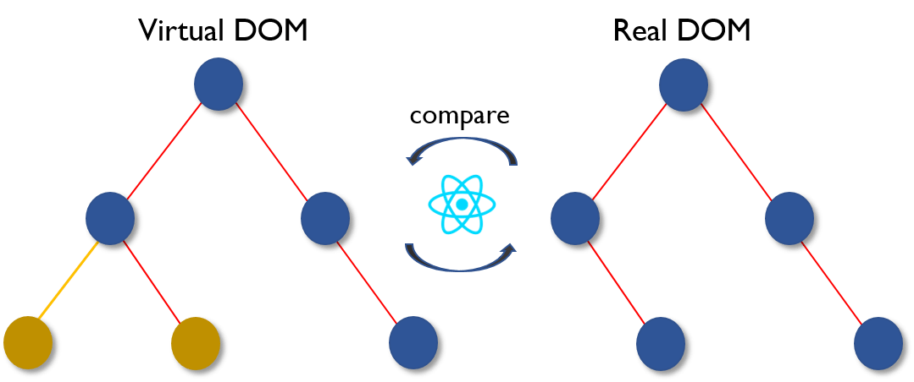

### Let's first understand DOM

- DOM stands for “Document Object Model”. When a web page is loaded, the browser creates a Document Object Model of the page & It's basically constructed as a tree of Objects.

- Frequently, manipulating the DOM affects performance as everytime there is a change in state of the application, the DOM has to render (display) that specific change.

### What makes DOM manipulation slow?

- As we have covered this before, DOM is represented as a tree data structure. This is the only reason we are able to change or update the DOM fast.

- Here comes the twist, change or update made on DOM is fast enough but after that, the updated elements or its children components has to re-render to update it directly to the application UI.

- Therefore, the more UI components you have, the more expensive the DOM updates could be, since they would need to be re-rendered for every DOM update.

### The Virtual DOM

- You can think of Virtual DOM as if the copy of the actul DOM. The difference is, everytime the state of our application changes, the virtual DOM gets updated instead of the real DOM.
- A virtual DOM object has the same properties as a real DOM object, but it lacks the real thing’s power to directly change what’s on the screen.
- When new elements are added to the UI, a virtual DOM, which is represented as a tree is created. Each element is a node on this tree. If the state of any of these elements changes, a new virtual DOM tree is created. This tree is then compared or “diffed” with the previous virtual DOM tree.
- Once React knows which virtual DOM nodes have changed, then React updates those nodes, and only those nodes, on the real DOM.
- This significantly improves the performance by updating those nodes which are actually affected, rather than updating the whole DOM Object.

###### Source: [edureka](https://www.edureka.co/blog/what-is-react/)

> 💡 TLDR: This is what you should know about `Virtual DOM` for now. But, if you want to explore how does React use Virtual DOM, then refer this; [Virtual DOM and Internals](https://reactjs.org/docs/faq-internals.html)
